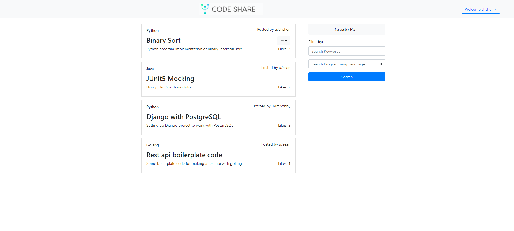
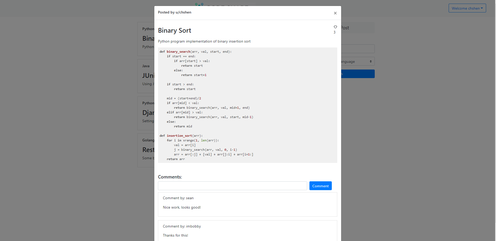

Backend for Code Share - a social code sharing platform.

Features included:
1. User authenication
2. Creating/Deleting/Updating posts
3. Filtering posts by keywords and programming language
4. Liking posts
5. Commenting on posts

